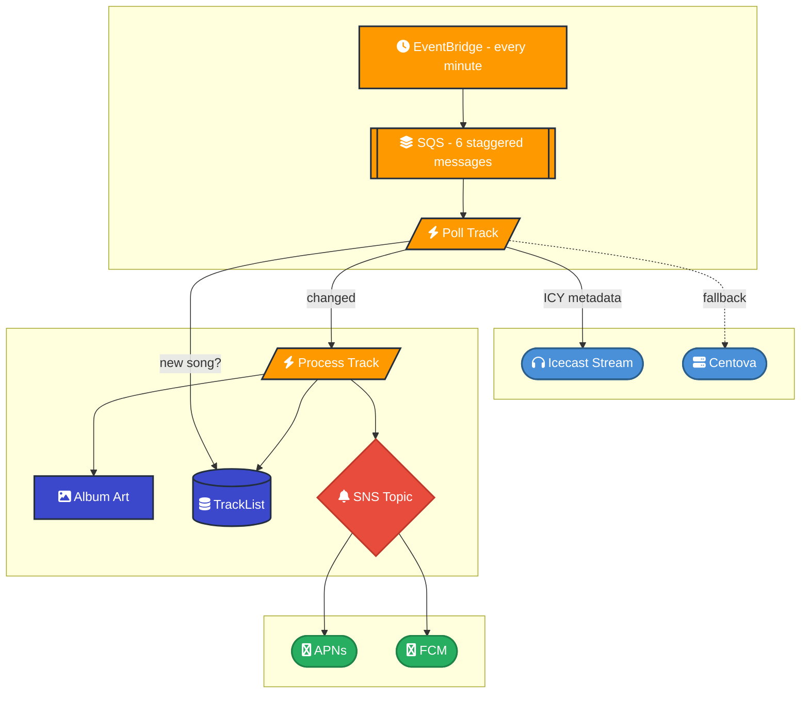
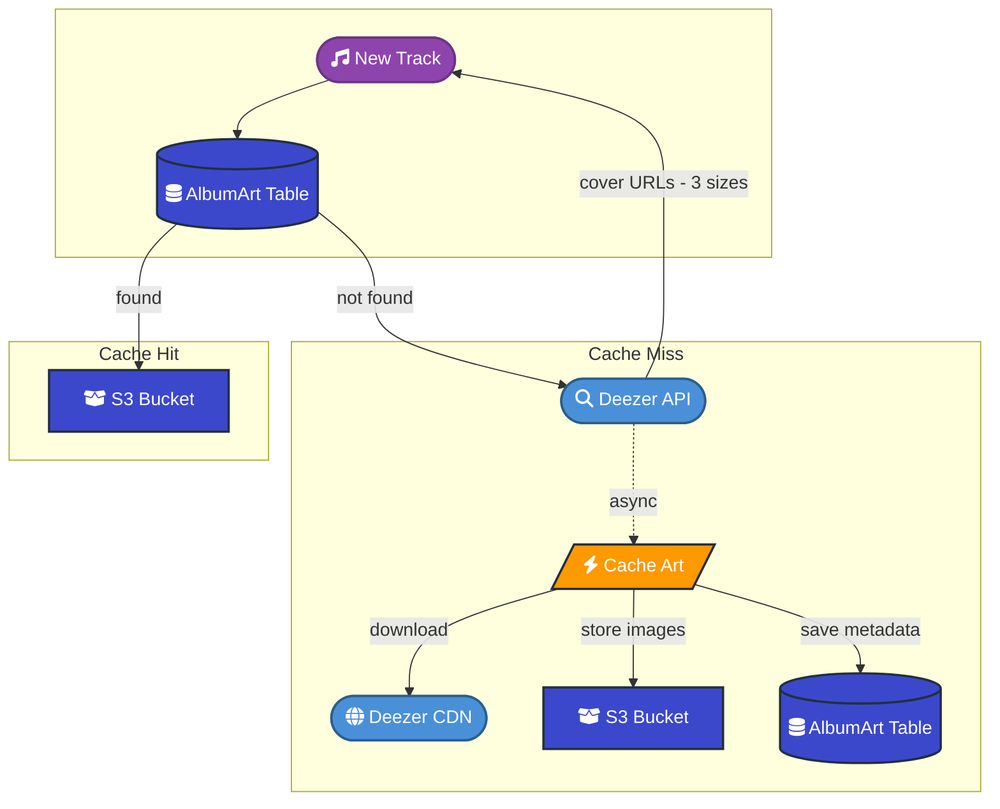
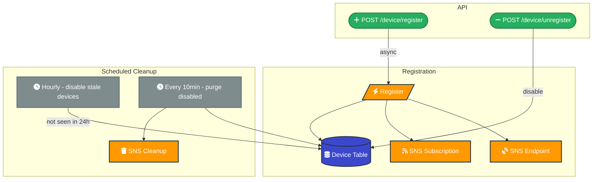
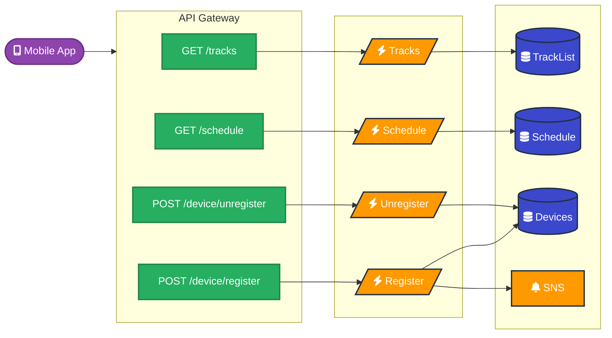

# BN Mallorca [](https://github.com/xiscosc/bn_mallorca_backend/actions/workflows/deploy-staging.yml) [](https://github.com/xiscosc/bn_mallorca_backend/actions/workflows/deploy-prod.yml)

Backend and infrastructure for the BN Mallorca Radio App.

## Technology Stack

- **Infrastructure**: AWS CDK (TypeScript)
- **Runtime**: Node.js with TypeScript
- **AWS Services**: Lambda, DynamoDB, S3, SNS, SQS, API Gateway
- **External APIs**: Deezer API, Icecast metadata streaming
- **Code Quality**: Biome (linter/formatter)

## Key Features

- **Track Polling**: Continuously polls Icecast metadata streams to track currently playing songs, storing track history in DynamoDB
- **Track List API**: Exposes recently played tracks via REST API
- **Album Art Caching**: Fetches and caches album artwork using Deezer API (public, no auth required), stores in S3
- **Device Subscriptions**: Manages push notification subscriptions for mobile devices via SNS
- **Radio Schedule**: Provides radio programming schedule endpoints

## Project Structure

```
bnmallorca-backend/
├── bin/                    # CDK app entry point
├── lib/                    # CDK infrastructure code
│   └── constructs/         # CDK constructs
├── src/
│   ├── function/           # Lambda function handlers
│   │   ├── album-art/      # Album art caching
│   │   ├── device/         # Device registration and cleanup
│   │   ├── schedule/       # Radio schedule endpoint
│   │   └── track/          # Track polling and track list API
│   ├── net/                # External service clients (Deezer, S3, SNS, etc.)
│   ├── repository/         # Data access layer (DynamoDB)
│   ├── service/            # Business logic
│   └── helpers/            # Utility functions
└── open-api.v1.json        # API specification
```

## Development

```bash
# Install dependencies
bun install

# Build
bun run build

# Linting
bun run biome        # Check code
bun run biome:fix    # Auto-fix issues

# CDK operations
bun run cdk deploy
bun run cdk synth

# Generate OpenAPI types
bun run generate:openapi
```

## Related Projects

- [BN Mallorca Android App](https://github.com/xiscosc/bnmallorca-android) - Android client application

## API Spec

[](open-api.v1.json)

## Architecture

### Track Polling

Every minute, the system polls the radio stream to detect the currently playing song. When a new track is found, it fetches album art, stores the track in history, and sends push notifications to all registered devices.



### Album Art Cache

When a new track is detected, the system looks up cover art by track ID. On cache hit, images are served directly from S3. On cache miss, it searches Deezer's public API, returns the URLs immediately, and caches the images asynchronously for next time.



### Device Subscriptions

Mobile apps register for push notifications via the API. The system creates an SNS platform endpoint per device and subscribes it to the notification topic. Stale devices are automatically disabled and cleaned up on a schedule.



### HTTP API

The mobile app consumes these endpoints, all behind API Gateway with throttling.


